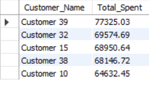
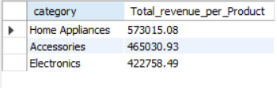

# 🛒 E-commerce Analysis  

A data analysis project to explore and visualize e-commerce sales data using **Python**, **SQL**, and **Excel**. The project provides insights into revenue, customer behavior, sales trends, and product performance.  

---

## 📂 Project Structure
- `data/` → Dataset (Excel/CSV)  
- `sql/` → SQL queries for analysis  
- `notebooks/` → Jupyter Notebook with Python code  
- `images/` → Final output charts and dashboards  

---

## 🔍 Analysis Includes
- 📈 **Total Revenue**  
- 🏆 **Top 5 Customers by Spending**  
- 📅 **Monthly Sales Trends (Last 12 Months)**  
- 📦 **Products Never Purchased**  
- 🌍 **Region-wise Sales Performance**  

---

## 📊 Final Results
  
    
 

---

## ⚙️ Requirements
- **Excel / CSV** (for dataset)  
- **Python Libraries:**  
  - `pandas`  
  - `matplotlib` / `seaborn` (for visualization)  
  - `sqlalchemy` or `mysql-connector-python` (for SQL connection)  
- **Database:** MySQL / SQLite  
- **Jupyter Notebook**  

Install dependencies:  
```bash
pip install -r requirements.txt
